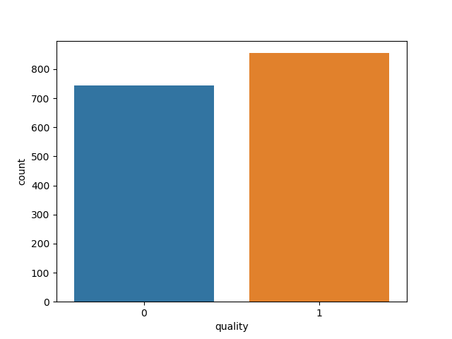
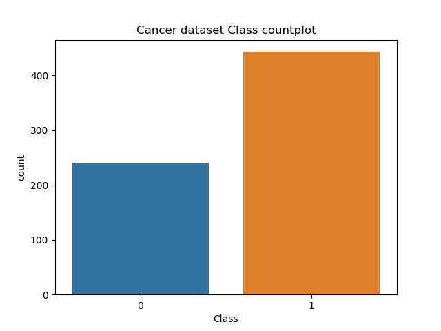
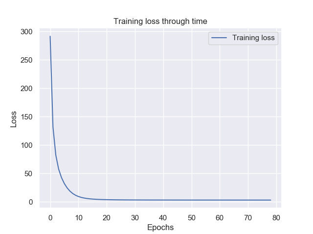
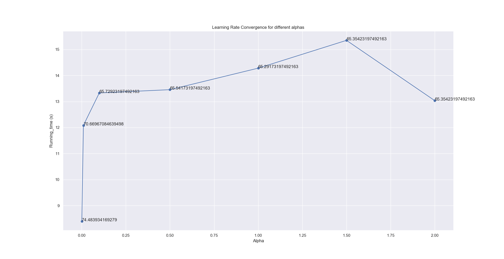
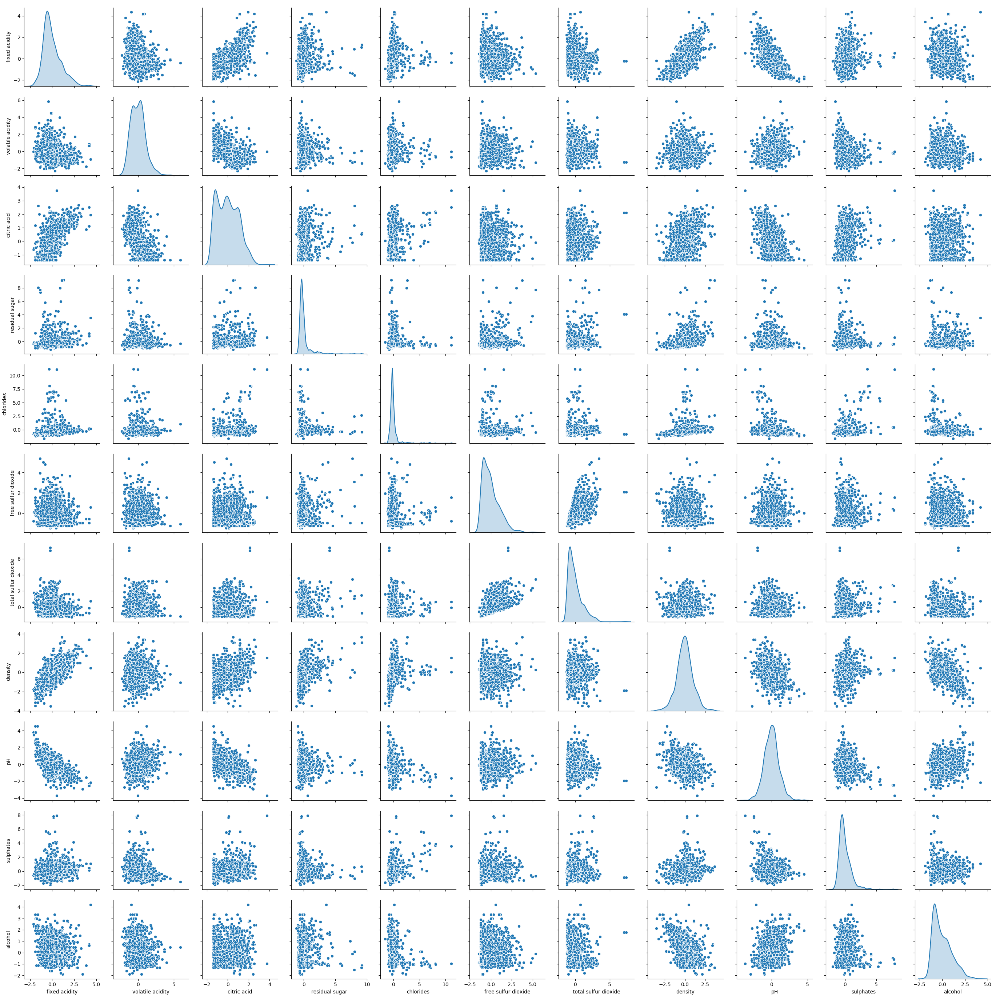
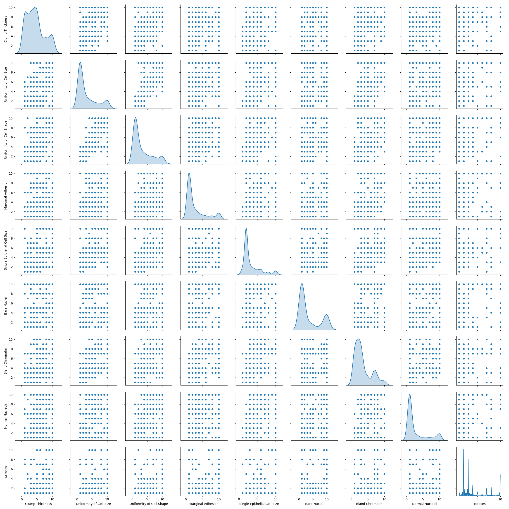

# Logreg_LDA_from_scratch
Implementing Logistic Regression and LDA from scratch, as well as data cleaning,  visualizations, k-fold cross-validation, CV-search, data-shufffling and feature engineering. 

Our paper: https://drive.google.com/file/d/1Ylg6MuNNjk6fBfCsZLKrxoeye4gG7hGZ/view?usp=sharing

## Boxplot of the red wine dataset target distribution 

## Boxplot fo the cancer dataset target distribution 

## Training loss for Logistic Regression with Gradient Descent

## Cross-validation running times with CV-accuracies for diffferent learning rates 

## Redwine normalized features pairplot

## Cancer normalized features pairplot 

